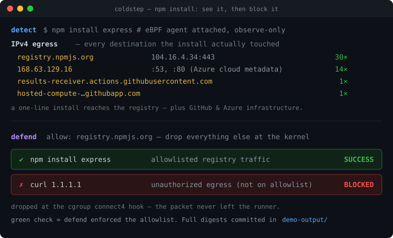

# coldstep-demo

**See exactly what popular package managers phone home to — then block it.** Powered by
[coldstep](https://github.com/coldstep-io/coldstep), an eBPF CI egress agent.



Every workflow here runs one install command (`npm install`, `pip install`, `cargo install`, …)
on a fresh `ubuntu-latest` runner with the coldstep eBPF agent attached. The agent records
every process spawned, every IPv4 destination contacted, every DNS lookup, and every TLS SNI —
and the digest is **committed right here in the repo** so you can read it without opening a
single CI log.

## The bytes — real captured digests

No "see the Actions tab", no expiring artifacts, no 404s. The actual output is in
[`demo-output/`](demo-output/):

| install | what it reaches out to | digest |
| :------ | :--------------------- | :----- |
| `npm install express @aws-sdk/client-s3` | `registry.npmjs.org` + GitHub Actions infra + Azure metadata | [npm.md](demo-output/v0.5.4/npm.md) |
| `pip install pandas numpy scikit-learn matplotlib` | `pypi.org`, `files.pythonhosted.org` | [pip.md](demo-output/v0.5.4/pip.md) |
| `cargo install ripgrep` | `static.crates.io`, `index.crates.io` | [cargo.md](demo-output/v0.5.4/cargo.md) |
| `go install …/gopls@latest` | `proxy.golang.org`, `sum.golang.org`, `storage.googleapis.com` | [go.md](demo-output/v0.5.4/go.md) |
| `apt-get install ffmpeg` | the Azure apt mirror, via `https`/`gpgv`/`apt-key` | [apt.md](demo-output/v0.5.4/apt.md) |
| `gem install jekyll` | `index.rubygems.org` (Fastly edge) | [gem.md](demo-output/v0.5.4/gem.md) |
| `npm install` in **defend** mode | registry allowed ✔, `1.1.1.1` dropped ✗ | [defend-npm.md](demo-output/v0.5.4/defend-npm.md) |

Each digest links back to the exact run that produced it. There's an asciinema replay too:
[`demo-output/casts/`](demo-output/casts/) (`asciinema play demo-output/casts/npm-detect-vs-defend.cast`).
Earlier captures against `@v0.4.1` are kept under [`demo-output/v0.4.1/`](demo-output/v0.4.1/)
for comparison.

> Pinned to [`coldstep-io/coldstep@v0.6.1`](https://github.com/coldstep-io/coldstep/releases/tag/v0.6.1).
> Since v0.5.4 the action writes a native digest to `.coldstep-<mode>.md` by default, so the
> `demo-output/v0.5.4/` digests are coldstep's own renderer output committed verbatim. Earlier
> captures (`v0.4.1`, `v0.5.3`) are summarized from each run's raw `.coldstep-events.jsonl` via
> the fallback extractor — see [demo-output/README.md](demo-output/README.md) for how, and why.

## Run a demo on your laptop in one command

```sh
./run-demo.sh npm detect     # watch what `npm install` phones home
./run-demo.sh npm defend     # watch defend mode block unauthorized egress
```

`run-demo.sh` runs the **exact** workflow from `.github/workflows/` locally — same coldstep
eBPF agent, same bytes you'd get in CI — using [`act`](https://nektosact.com). It takes any of
`npm|pip|cargo|go|apt|gem` and `detect|defend`. No `act` on the host? Use the bundled container:

```sh
docker compose run --rm coldstep-demo ./run-demo.sh npm detect
```

> Needs Docker + a Linux kernel with BTF + eBPF. Native Linux works directly; Docker Desktop
> (macOS/Windows) and WSL2 ship a BTF-enabled kernel, so it works there too.

## detect vs defend

**`mode: detect`** (default) — observe-only. The agent records everything; nothing is blocked.
Use it to *discover* what a build actually contacts before you write an allowlist. Every detect
digest ends with a **suggested allowlist** you can copy straight into defend mode.

**`mode: defend`** — IPv4 egress not on the allowlist is dropped at the cgroup
`connect4`/`sendmsg4` hook (plus BPF LSM where available). The
[defend demo](.github/workflows/defend-npm.yml) allows only the npm registry, proves a normal
`npm install express` still succeeds, then watches an unauthorized connection to `1.1.1.1` get
dropped before it leaves the runner — the job goes **green because the block worked**.

## The workflows

| Workflow | Installs | Committed digest | Live |
| :------- | :------- | :--------------- | :--- |
| [npm](.github/workflows/npm-install.yml) | `express`, `@aws-sdk/client-s3` | [npm.md](demo-output/v0.5.4/npm.md) | [Actions](https://github.com/coldstep-io/coldstep-demo/actions/workflows/npm-install.yml) |
| [pip](.github/workflows/pip-install.yml) | `pandas`, `numpy`, `scikit-learn`, `matplotlib` | [pip.md](demo-output/v0.5.4/pip.md) | [Actions](https://github.com/coldstep-io/coldstep-demo/actions/workflows/pip-install.yml) |
| [cargo](.github/workflows/cargo-install.yml) | `ripgrep` | [cargo.md](demo-output/v0.5.4/cargo.md) | [Actions](https://github.com/coldstep-io/coldstep-demo/actions/workflows/cargo-install.yml) |
| [go](.github/workflows/go-install.yml) | `gopls@latest` | [go.md](demo-output/v0.5.4/go.md) | [Actions](https://github.com/coldstep-io/coldstep-demo/actions/workflows/go-install.yml) |
| [apt](.github/workflows/apt-install.yml) | `ffmpeg` | [apt.md](demo-output/v0.5.4/apt.md) | [Actions](https://github.com/coldstep-io/coldstep-demo/actions/workflows/apt-install.yml) |
| [gem](.github/workflows/gem-install.yml) | `jekyll` | [gem.md](demo-output/v0.5.4/gem.md) | [Actions](https://github.com/coldstep-io/coldstep-demo/actions/workflows/gem-install.yml) |
| [defend (npm)](.github/workflows/defend-npm.yml) | `express`, allowlist enforced | [defend-npm.md](demo-output/v0.5.4/defend-npm.md) | [Actions](https://github.com/coldstep-io/coldstep-demo/actions/workflows/defend-npm.yml) |

All scheduled workflows run weekly (Monday mornings, UTC) so the picture stays current as the
ecosystems shift. Each is also `workflow_dispatch`-able from the Actions tab.

## Reading a digest

- **Processes:** every `exec()` chain the install triggered (npm → node → `node-gyp` → `cc1` → linker, …).
- **IPv4 egress:** every destination contacted, with the process that reached it and a byte/event count.
- **TLS SNI / HTTP host:** which logical hosts were addressed inside the TLS sessions.
- **BPF program health:** load status of each probe, so you know the digest isn't blind.
- **Suggested allowlist:** copy/paste those lines into `allow:` to lock the same install down in defend mode.

For defend runs the `deny` events (the dropped destinations) are recorded in
`.coldstep-events.jsonl` on the runner, but that telemetry is **not** uploaded as an artifact —
while defend is enforcing it drops the uploader's own egress too (see
[defend-npm.md](demo-output/v0.5.4/defend-npm.md)). The authoritative defend signal is the
green-on-block assert step, not an artifact.

## Adapt these demos for your own repo

Each workflow file is a standalone template — open the one matching your package manager, copy
it whole, and swap in your own install command. The minimal shape:

```yaml
- uses: coldstep-io/coldstep@v0.6.1
  with:
    mode: detect
    detect-profile: enhanced
    fail-on-error: true

- name: Your build step
  run: <your install/build command>
```

Every demo also echoes the action's `suggested-allow` output into the Job Summary and uploads
the raw telemetry as artifacts — copy those steps verbatim from any
[workflow file](.github/workflows). Once you know what the install legitimately contacts, switch
to `mode: defend` and paste the suggested allowlist into the `allow:` input.

**Reference:** Full input reference, defend-mode setup, IPv4 scope and limits, and the agent
architecture live at **[coldstep-io/coldstep](https://github.com/coldstep-io/coldstep)**.
